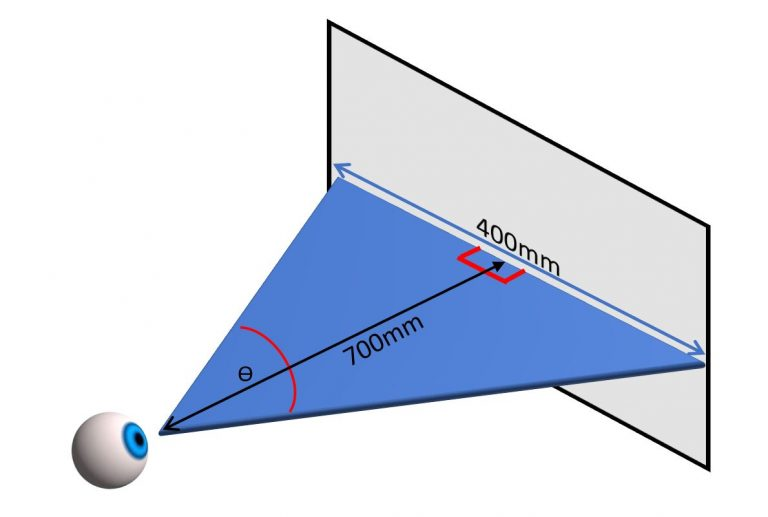
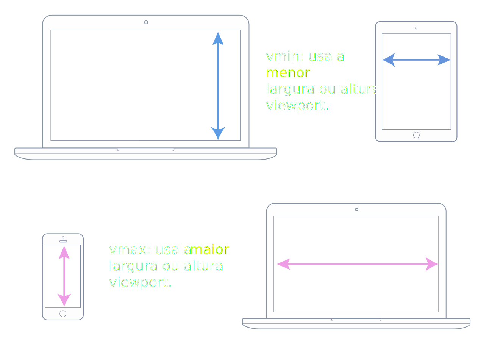

## Elementos Semânticos

## Estrutura de pastas

root/
images
pages
sobre.html
samples/
test
src/
css
index.html
readme.md

### Resolução de tela: 1920x1080

## Microdados

-   Parte do padrão HTML. Mecânismos de pesquisa e rastreadores consomes os dados com mais eficiência.
-   Servem para aninhar metadados em conteúdo existente em páginas WEB. (Microdata, RDFa, JSON-LD)

### Microdata

Angry Birds -

REQUIRES <sp itemprop="operatingSystem">ANDROID</sp

<link itemprop="applicationCategory" href="https://schema.org/gameApplication">

Pontuação:
4.6(
8834 avaliações
)

Preço: R$ 10.00 
<meta itemprop="priceCurrency" content="USD>"/>

## RDfa

<!DOCTYPE html>
<html lang="pt">
<head>
<title>Exemplo de Documento</title>
</head>
<body vocab="http://schema.org/" >

Bem-vindo ao <a property="url" href="http://texpersts.com.br/blog">blog da T.EX</a>

</body>
</html>

## JSON-LD (Link Data)

<html>
<head>
<title>Bolo de Café</title>

</head>
<body>
<h2>Bolo de Café</h2>

Preparação: 20 minutos

</body>

[cooking](https://giphy.com/gifs/masterchef-chefs-home-cooks-masterchef-season-7-3oEjHC7al4GfnudR7y)

## Length CSS

### px
>Medida angular
 

### cm, in, mm 
Mapeados para pixels
1cm == 37.8px  
1in == 96px  
1mm == 0.1cm == 3.78px  

### em
> 1em == 16px == 12pt  
> font-size: 14px  
> div > font-size: 1.2em  
> div > div > div (font-size)  
> primeira = 14px > segunda = 20.16 > terceira = 24.192

### rem
> Base no root (html) não vai ter cascata

### pt
> 1pt == 1/72 polegadas
 
### pc
> 1pc == 12pt

### porcentagem (%)
> img width=50% relativo ao elemento que ela está contida  
> height (atenção com as porcentagens)

### vh, vw
>1vh == 1% da altura da janela de visualização  
> vw == 1% da largura da janela de visualização  

### vmax, vmin

### CSS (aplicação)
> você pode aplicar estilo a um documento HTML de 3 maneiras: 
- 1= style.css 
- 2=  
- 3= <tag style="">lorem</tag> 

### Atributos
- Atributos e valores de um elemento
> input[type=text]

### Prefixo dos Browsers
- webkit[-webkit] chrome, safari, opera +
- moz [-moz] firefox
- o[-o]opera-
- ms[-ms]internet explorer,edge

# Box Model

> width / height
> max-width / min-width
> margin: 0 0 0 0 (top right bottom left)
> padding: 0 0 0 0 (top right bottom left)
> border-width 0 0 0 0 (top right bottom left)
> border-radios: 0 0 0 0 (top right bottom left)

## Variações
> margin:0(todos os lados)
> margin:0 0 (top/ bottom/ right/ left)

# Responsive Design

>Mobile (portrait)
- 320
- 375
- 414

>Mobile (landscape)
- 568
- 667
- 736
- 812

>Tablet (portrait)
- 768
- 834
  
> Tablet (landscape)
- 1024
- 1112

>Laptop
- 1366
- 1440
  
>Desktop
- 1680
- 1920
- 2048
---
## FLuid Grids
Linhas e colunas que se ajustam mediante os breakpoints

---
## Breakpoints
Pontos de tamanho de tela especificados no css associados a janela de visualização (@media)

---
## Flexible Images
Verificar o redimensionamento das imagens que é feito em porcentagem.

---
## Media Querie
Especificações CSS que contém as informações sobre a janela de visualização

---
## Viewport
        <meta name="viewport
        content="width=device-width,
        initial-scale=1.0"/>

---
## Overflow
Elementos de tela que estão fora do layout ou parcialmente fora do layout

---
## Fixed Size
Utilizam pixels como largura ou altura.

---
## Relative Size
Utilizam medidas como o rem ou %

---

## Mobile First
Técnica de layout que primeiro analisa telas menores

--- 
## Hamburguer Menu

---
# Box Sizing 
## Deixar box em tamanho padrão)

*{
    box-sizing:border:box;
}

# Float 
## Auxilar a trazer elementos de bloco para uma forma de linha)

asduhasuid hasipdu haskjdh askl jdhalk sjhdlakjs hfiuahsdf is hfklasjd h aklsjdhf askdjfh slkdjfh aslkdj askldjfh askldjf 

